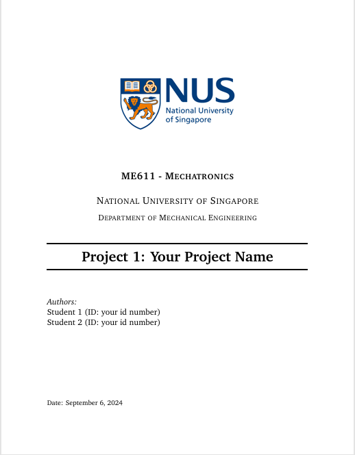

# NUS Report Template-LaTex

## 📌Intro

This template is modified from [Jean-Pierre Hicke's Format](https://www.overleaf.com/latex/templates/university-of-waterloo-me303-report-format/fvcvbdbfpmmt) for NUS course project report.

⭐Star my repository if it's useful for you😉

[View PDF doc here](./NUS_Report_Template.pdf).



## 🔧Usage

### Edit by Overleaf

1. Download the `Source code.zip` from `releases`
2. Upload `zip` file in Overleaf's `Upload Project`

### Bibliography Style

The reference numbers in the default template are sorted by the first author's last name's initial. If you want to sort them in the order of citation, please change command `\bibliographystyle{plain}` to `\bibliographystyle{unsrt}` in `main.tex` file.

## 📄Update

```
- 22.Aug.2024
	- Uploaded the Logo for NUS.
	- Changed the footnote of pages to right. 

- 06.Sept.2024
	- Aligned the heading of pages to left. 

- 07.Sept.2024
	- Updated the `Usage` of `Bibliography Style`


```

