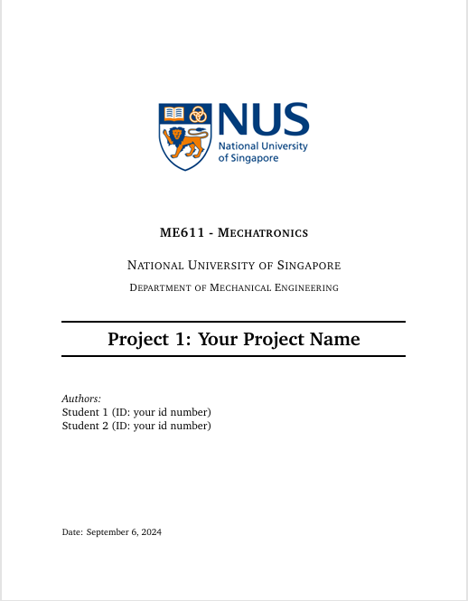

# NUS Report Template-LaTeX

[](https://opensource.org/licenses/MIT)
[](https://www.latex-project.org/)

A professional LaTeX template for NUS (National University of Singapore) course project reports and assignments.

## 📌 Introduction

This template is modified from [Jean-Pierre Hicke's Format](https://www.overleaf.com/latex/templates/university-of-waterloo-me303-report-format/fvcvbdbfpmmt) and customized for NUS course project reports. It features:

- Professional title page with NUS logo
- Proper formatting for academic reports
- Bibliography management with BibTeX
- Support for figures, tables, and mathematical equations
- Clean and organized structure

⭐ **Star this repository if you find it useful!**

## 📸 Preview

[View the PDF example here](./NUS_Report_Template.pdf)



## 🔧 Usage

### Method 1: Using Overleaf (Recommended)

1. Download the latest `Source code.zip` from [Releases](https://github.com/Yuxiang-Xiao/NUS-Report-Template-LaTex/releases)
2. Go to [Overleaf](https://www.overleaf.com/)
3. Click on "New Project" → "Upload Project"
4. Upload the downloaded `zip` file
5. Start editing!

### Method 2: Local LaTeX Installation

1. Clone or download this repository:
   ```bash
   git clone https://github.com/Yuxiang-Xiao/NUS-Report-Template-LaTex.git
   ```
2. Open `main.tex` in your LaTeX editor (TeXStudio, TeXMaker, VS Code with LaTeX Workshop, etc.)
3. Compile using `pdflatex` or your editor's compile button

#### Compilation Commands

```bash
pdflatex main.tex
bibtex main
pdflatex main.tex
pdflatex main.tex
```

## 📝 Customization

### Editing Project Information

In `main.tex`, modify these lines to customize your report:

```latex
\newcommand{\reporttitle}{Project 1: Your Project Name}
\newcommand{\reportauthorOne}{Student 1}
\newcommand{\cidOne}{your id number}
\newcommand{\reportauthorTwo}{Student 2}
\newcommand{\cidTwo}{your id number}
\newcommand{\reporttype}{Coursework}
```

### Changing Course Information

In `titlepage.tex`, update the course details:

```latex
\textbf{\textsc{\Large ME611 - Mechatronics}}\\[1.0cm] 
\textsc{\large Department of Mechanical Engineering}\\[0.95cm]
```

### Bibliography Style

The reference numbers in the default template are sorted by the first author's last name. To sort them in order of citation:

1. Open `main.tex`
2. Change `\bibliographystyle{plain}` to `\bibliographystyle{unsrt}`

### Table of Contents

To enable the table of contents, uncomment these lines in `main.tex`:

```latex
%\tableofcontents
%\newpage
```

## 📁 File Structure

```
├── main.tex              # Main document file
├── titlepage.tex         # Title page template
├── includes.tex          # Package imports and configurations
├── notation.tex          # Custom mathematical notations and macros
├── mybib.bib            # Bibliography database
├── figures/             # Directory for images and figures
│   ├── nus.jpg         # NUS logo
│   └── goose.png       # Example figure
├── dsfont.sty          # Font style file
└── kpfonts.sty         # Font style file
```

## 🤝 Contributing

Contributions are welcome! Please see [CONTRIBUTING.md](CONTRIBUTING.md) for guidelines.

## 📄 Changelog

### 2024-09-07
- Updated the `Usage` section for `Bibliography Style`

### 2024-09-06
- Aligned the heading of pages to left

### 2024-08-22
- Uploaded the NUS Logo
- Changed the footnote of pages to right

## 📜 License

This project is licensed under the MIT License - see the [LICENSE](LICENSE) file for details.

## 🙏 Acknowledgments

- Original template by [Jean-Pierre Hicke](https://www.overleaf.com/latex/templates/university-of-waterloo-me303-report-format/fvcvbdbfpmmt)
- NUS community for feedback and suggestions

## 📧 Contact

If you have questions or suggestions, please:
- Open an [issue](https://github.com/Yuxiang-Xiao/NUS-Report-Template-LaTex/issues)
- Submit a [pull request](https://github.com/Yuxiang-Xiao/NUS-Report-Template-LaTex/pulls)

---

Made with ❤️ for the NUS community
